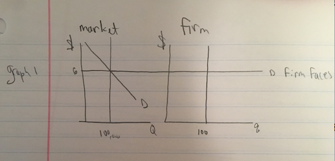
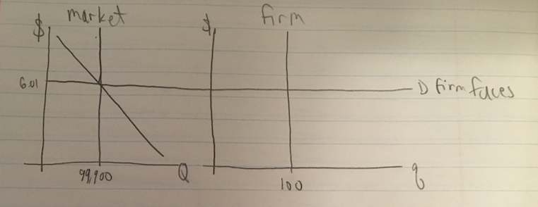
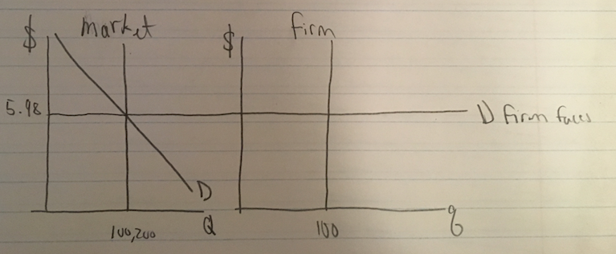
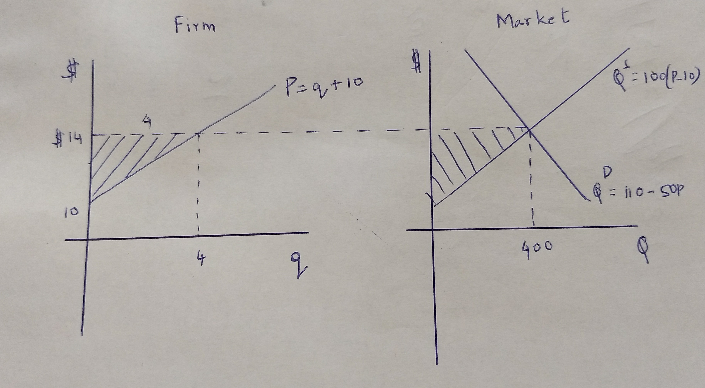
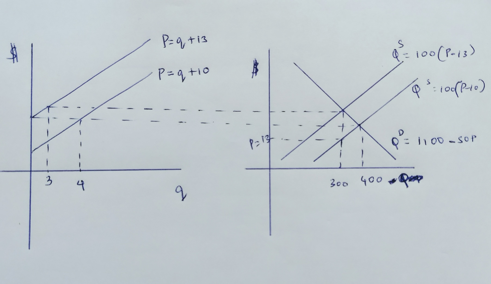
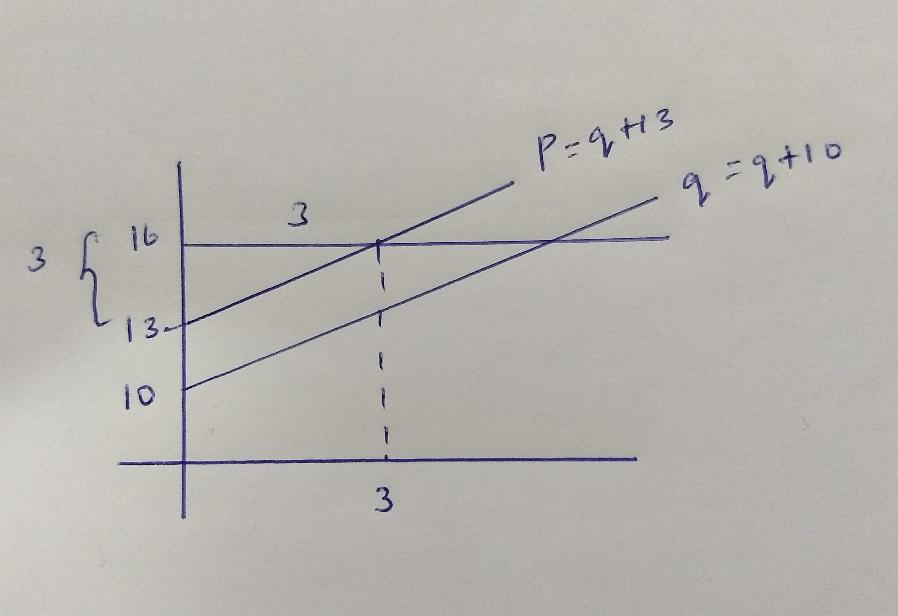

# Chapter 12 Solutions {-}

*Contributed by Conner Naughton and Gowthami Venkateswaran 2017*

12.3 a)    $n = 1000$, $q = 100$  

fixed supply  
 
$$Q = 100*1000 = 100,000$$ 
				
equilibrium: 
$$supply = demand$$

$$100,000 = 160,000 - 10,000p$$

$$10,000p = 60,000$$
		
$$p = \$6$$

$$Q = 100,000$$
$$ n =  1000$$ 

b) Graphs: 1

c) Graphs: 2 

$$99,900 = 160,000 - 10,000P$$

$$P = 6.01 $$

If one firm sells nothing, other firm faced with demand: $P = 6.01$

Graph 3

$$100,200 = 160,000 - 10,000P $$

$$P = 5.98$$

If one firm instead sells 200.

d) Industry demand elasticity.   

\begin{align*}
e_{p,q} &= \frac{\Delta Q}{ \Delta P} \\
        &=\frac{dQ}{dP}*\frac{P}{Q} \\
        &=\frac{-10,000*6}{100,000} \\
        &= -0.6
\end{align*}
        
Demand elasticity faced by an individual firm. Perfectly elastic (market is perfectly competitive).

12.5)   

Demand: $Q = 1500 - 50P$ 

$$C(q) = \frac{1}{2}q^2 - 10q +w$$

\begin{align*}
MC(q) &= q-10 \\
    p &= q-10 \\
    q &= p+10
\end{align*}

$$AC(q) = \frac{q}{2}-10 + \frac{w}{q}$$
Market supply can be expressed by: 

$$Q= n*q = n(p+10)$$

So the market clearing condition is:

$$S=D$$

\begin{align*}
n(p+10) &= 1500-50p \\
np+n*10 &=1500-50p \\
(50+n)p &=1500-10n \\
\end{align*}

Subbing in the entreprenuer condition $n=0.25w$  

\begin{align*}
(50+\frac{w}{4})P &=1500-\frac{10w}{4}
\end{align*}

\begin{algin*}
(200+w)P&=6000-10w \\
(200+w)(\sqrt{2w}-10)&=6000-10w \\
(200+w)\sqrt{2w}-10(200+w)&=6000-10w \\
(200+w)\sqrt{2w}&=8000
\end{algin*}  

 
Now, from the no profit condition we know that the MC equals to the Average cost.

$$q-10=\frac{q}{2}-10+\frac{w}{q}$$

$$\frac{q}{2}=\frac{w}{q}$$
$$q^2=2w$$
$$q=\sqrt{2w}$$
Then 

$$w = \frac{(p+10)^2}{2}$$
Now we have found two equations with only $p$ and $w$ in it. Two equations in two unknowns should be possible to solve. 

$$[50 + \frac{(p+10)^2}{8}]p = 1500 - 10\frac{(p+10)^2}{2} $$
Verify that $P=10$ solves this equation. Then it follows that $q=20$, $n=50$, $Q=1000$.

12.6)  

$$STC = \frac{q^2}{2}+10q+5$$

$$SMC = q+ 10$$
a) Firm

$$ p=SMC$$  

$$p=q + 10  inverse supply$$  

$$q =p-10 supply$$

Industry: 100 firms =>  

$$Q=100(P-10) supply$$

b)Demand: 

$$Q=1100-SOP$$  

D=S =>  

$$1100-SOP=100P-1000$$  

$$2100 = 150P$$  

$$$14=P^*$$  

$$Q^*=1100-SO.14 = 400$$  

$$q=4$$ 

Firm's profit - p.q - STC(q)

$$ =14(4) - (4\frac{2}{2}+10(4)+8)$$  

  $$=56-53$$  
  
 $$\pi  firm = $3$$

c) Figure 1 here

 

PS of 1 firm is $\frac{1}{2}.4.4 = 8$ and there are 100 firms
 Total PS = $$100.8 = $800$$

d) Industry Profit $$= 100.3 = $300$$ 

Short run fixed cost $$= 5.100 = $500 $$(5 from the non-variable part of the cost function)

Industry Profit + SFC $$= 300 + 500 = 800 $$(Same as total PS)

e) Now SMC - q +13

$$p = q+13$$

$$q-p-13$$ and$$ Q=100(p-13)$$

Clear market S=D

$$100(p-13)=1100-SOP$$  

$$100p-1300=1100-SOP$$ 

$$150P=2400$$  

$$P=$16$$ 

$$q=16-13-3$$  

$$Q=100.3=300$$

f) Figure 2 here

So incidence is shared \$1 by producer and \$2 by consumers.

$$Q = 100(P-10)$$ 

$$300=100(P-10)$$

$$3=P-10$$
$$13=P$$

g) Figure 3 here

New PS =$$\frac{1}{2}3.3$$

$$ = 9/2$$

 Total industry PS $$ = 100.\frac{9}{2}$$ 
 
$$ =$450$$
 That makes a loss in PS of $$800 - 450 = $350$$

New short and profit 

$$ = 16.3 - ( \frac{3^2}{2} + 13.3 + 8)$$ 

$$=48-48.5$$
 $$= -0.50$$ per firm or \$-50 industry. This makes a change in profit of $$$300+$50 = $350$$ decrease, same as the reduction in total PS.
Only MC makes for quality decisions, the tax affects MC not FC

