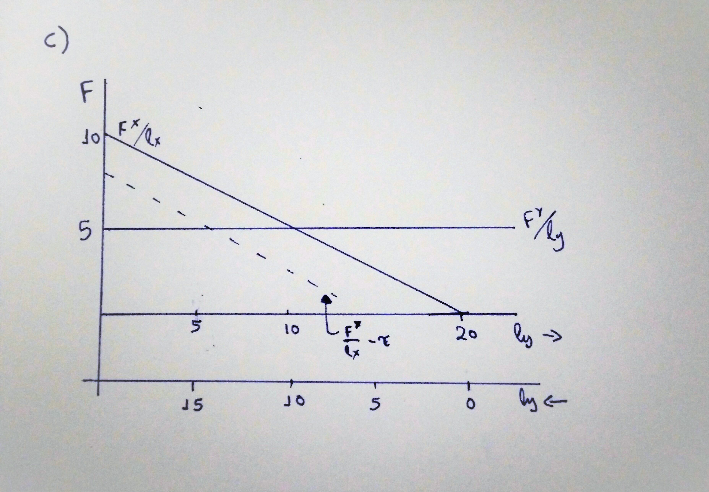
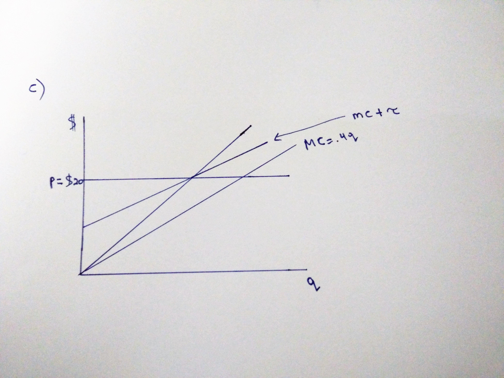
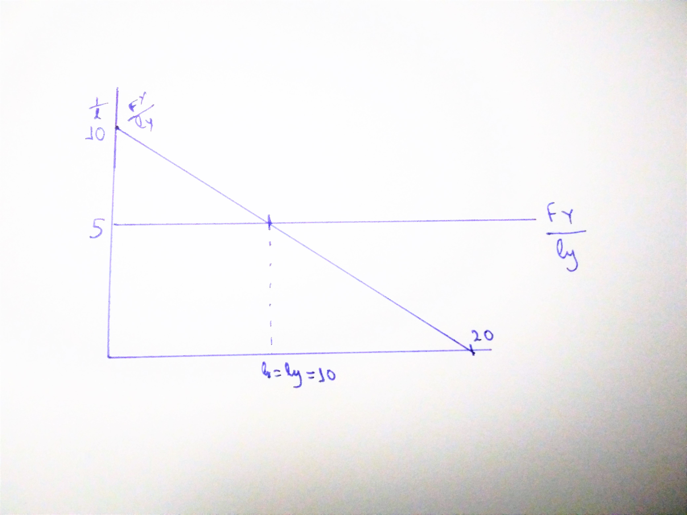

# Chapter 19 Solutions {-}
Chapter 19 Solutions

19.1 a) Produce when $P=MC$ for max profit.
$$20=.4q$$$$q^{*}=50$$
b) Socially optimal when $P=MSC$ $$20=.5q$$ $$q^{*}=40$$at optimum $q^{*}=40$, what is the difference between $SMC$ and $MC$?
$$SMC(40)-MC(40)=t$$$t$=tax to bring about optimal production$${.5}\cdot{40}-{.4}\cdot{40}=4=t$$
Verifying...
$\pi=pq-C(q)-tq$$$\frac{d\pi}{dq}=p-C^{\prime}(q)-t=0$$$$p=C^{\prime}(q)+t$$$$20=.4q+4$$$$q^{*}=40$$

c) Graphs: 

You know you want to reduce the net payment of lake x so that in net the 5th **fisherman** earns the same after paying the fee that he could at lake y.
$$\frac{F^{*}}{l_{x}}-t=5$$$$10-{\frac{1}{2}}\cdot{5}-t=5$$$$5-2.5=t$$$$2.5=t$$$t$=license fee that optimizes the alllocation of fisherman at both sides.

c) Graphs:

This graph is different from the example in class because the $SMC$ is not a constant per unit produced. It is a proportion of the quantity produced. We can still get the optimum by setting $t=SMC-MC$ at the optimal $q^{*}$. This is the only point at which $SMC=MC+t$ but that is fine.

19.2
  $$Total$$$$F^{x}=10l_x-\frac{1}{2}l_x^2$$$$F^{y}=5l_y$$
  $$Average$$$$\frac{F^{x}}{l_x}=10-\frac{1}{2}l_x$$$$\frac{F^{y}}{l_y}=5$$
Each fisherman gets **usage** of the lake on which the fish ***(is a word missing?)***. If any other configuration **than** $l_x=l_y=10$ there is incentive for the fisherman to switch lakes.

b) 
Chief could max to **total** fish. 

$max$ $F^{x}+F^{y}$  so that    $l_x+l_y=20$

$\mathop{max}_{l_x,l_y}$  $10l_x-\frac{1}{2}l_x^2+5l_y$ so that $l_y=20-l_x$

$\mathop{max}_{l_x}$ $10l_x-\frac{1}{2}l_x^2+5(20-l_x)$

$FOC:$ $10-l_x-5=0$ $$l_x^{*}=5$$$$l_y^{*}=15$$

19.3) A Firm maximizes its own profit:
$$\mathop{\Pi}_{f,n}=10q-1,000$$

$$\mathop{\Pi}_{f,n}=10(500-n)-1,000$$

$$\mathop{\Pi}_{f,n}=5,000-10n-1,000$$

$$\mathop{\Pi}_{f,n}=4,000-10n$$

Firms will enter until all profits are exhausted from this oil field.
$$4,000-10n{>}_{=}0$$$$4,000>_=10n$$$$400>=n$$
400 firms will drill each production $q=500-400=100$ and total output will be $Q=400\cdot100=40,000$

Yes, there is a divergence in private and social marginal cost. The firms don't take into account that their drilling reduces the productivity of other wells.

b)
$\Pi_{agg}=10Q-1,000Q$
$\Pi_{agg}=10(500n-n^2)-1,000n$
$\Pi_{agg}=5,000n-10n^2-1,000n$
$\Pi_{agg}=4,000n-10n^2$

$$\frac{d\Pi_{agg}}{dn}=4,000-20n=0$$$$n=200$$
$$q=500-200=300$$$$Q=200\cdot300=60,000$$

c) Set fee so that firms **enter** until the optimal n.

Firm$\Pi$: $10q-1,000-t$,$($t$=fee)$
Firm$\Pi$: $10(500-n)-1,000-t=0$ (no entry condition)
Firm$\Pi$: $10(500-200)-1,000-t=0$ (**200**=optimal **n** of firms)
Firm$\Pi$: $3,000-1,000-t=0$
${$}2,000=t$ fee per well
